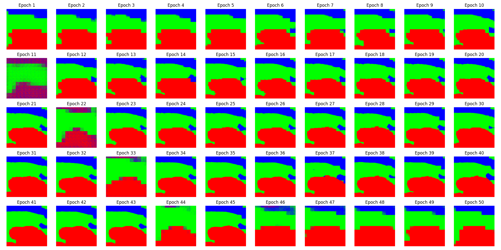
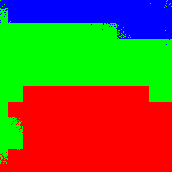
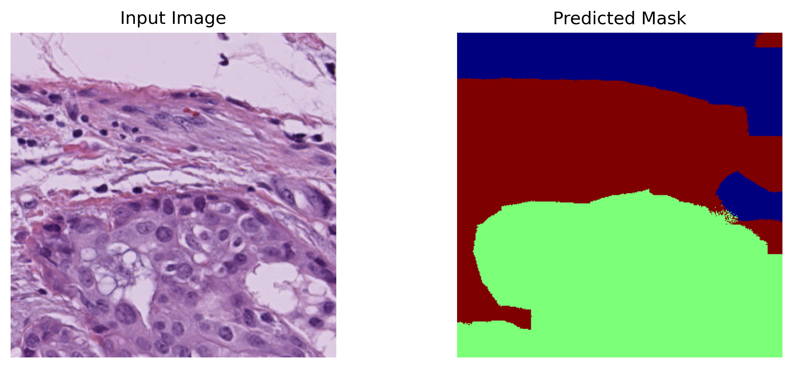
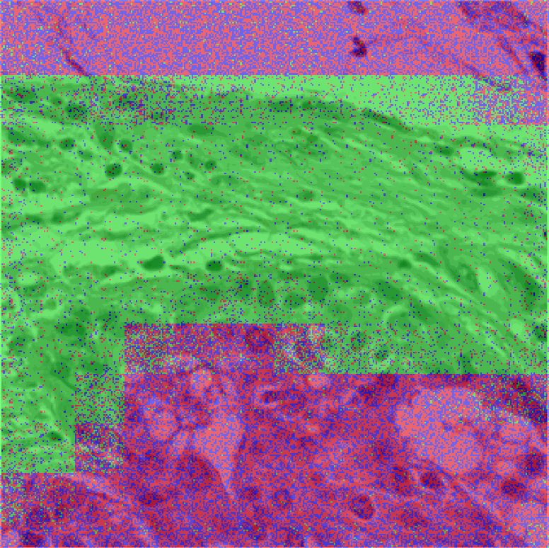

# Breast Cancer Segmentation (Week5.1)

This project implements a semantic segmentation pipeline for breast cancer histopathology images using PyTorch. The dataset is sourced from Kaggle: [`lucasiturriago/breast-cancer-multi-annotators`](https://www.kaggle.com/datasets/lucasiturriago/breast-cancer-multi-annotators).

## Project Overview
- Loads breast cancer histopathology images and their segmentation masks (3 classes: Other, Tumor, Stroma).
- Trains a Fully Convolutional Network (FCN) with a ResNet18 backbone to predict segmentation masks.
- After every epoch, saves the predicted mask for a fixed image to `segmentation/predictions/`.
- Converts these masks to colored images (black, red, green) in `segmentation/predictions/colored/` to visualize progress.
- The final output is a trained model and a sequence of colored masks showing how segmentation improves over epochs.

## Example Results
### Segmentation Progress Grid


### Segmentation Animation GIF


### Final Output Mask


### Overlay Animation (Mask on Original Image)


## Folder and File Guide
- `main.py`: Main script to train the model and save predictions.
- `model.py`: Defines the FCN segmentation model.
- `train.py`: Training loop, saves progress masks after each epoch.
- `dataset.py`: Loads images and masks for training.
- `data_load.py`: Utility for loading image and mask paths from the dataset directory.
- `util.py`: Helper functions (e.g., IoU calculation).
- `convert_mask_to_colours.py`: Converts raw mask PNGs (with class indices) to colored images for visualization. Use this to process masks in `segmentation/predictions/` and output to `segmentation/predictions/colored/`.
- `segmentation/`: Stores model weights and prediction outputs.
  - `model.pth`: Saved model weights after training.
  - `predictions/`: Raw predicted masks (PNG) for the same image after each epoch.
  - `predictions/colored/`: Colored versions of the predicted masks for easy visualization.
- `images/`: Example outputs and visualizations.
  - `segmentation_animation.gif`: Animated GIF showing segmentation progress over epochs.
  - `segmentation_grid.png`: Grid of colored masks across epochs.
  - `segmentation_result.png`: Final colored mask from the last epoch.
  - `segmentation_animation_with_bg.gif`: Animated GIF with masks overlaid on the original image.
  - `segmentation_result.png`: Final mask overlay.

## How to Use This Repo
1. **Clone the repository:**
   ```bash
   git clone <repo-url>
   cd Week5.1
   ```
2. **Install dependencies:**
   ```bash
   pip install -r requirements.txt
   ```
3. **Run the main script:**
   ```bash
   python main.py
   ```
   This will download the dataset, train the model, and save predictions.
4. **Convert and visualize colored masks:**
   - Run `convert_mask_to_colours.py` to convert raw masks to colored images in `segmentation/predictions/colored/`.
   - Use `view.py` for quick inspection of colored masks.
   - Example visualizations and GIFs are in the `images/` folder.

## Visualizing Results
- The colored masks show how the model's segmentation improves over epochs.
- The GIFs and grids in the `images/` folder provide a quick visual summary of training progress and final results.
- Overlay animations help compare predictions with the original image.

## Dataset
- The dataset is automatically downloaded from Kaggle using KaggleHub in `main.py`.
- No manual download required.

## File Summary
- **main.py**: Run this to train and generate outputs.
- **model.py**: Model architecture.
- **train.py**: Training logic and progress saving.
- **dataset.py/data_load.py**: Data loading utilities.
- **util.py**: Helper functions.
- **convert_mask_to_colours.py**: Converts raw masks to colored images.
- **view.py**: Quick mask visualization.
- **images/**: Example outputs and visualizations.
- **segmentation/**: Model weights and predictions.

---
For any custom visualization, see the scripts in the repo or use your own tools to explore the outputs in `images/` and `segmentation/predictions/colored/`.
